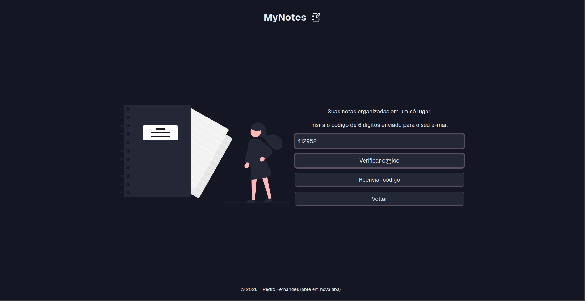
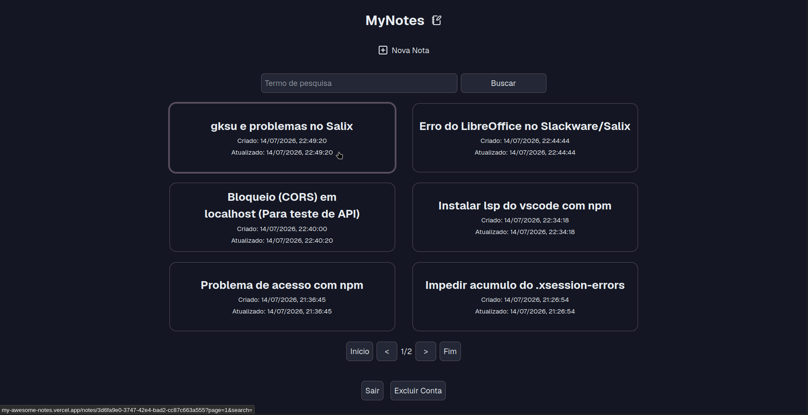
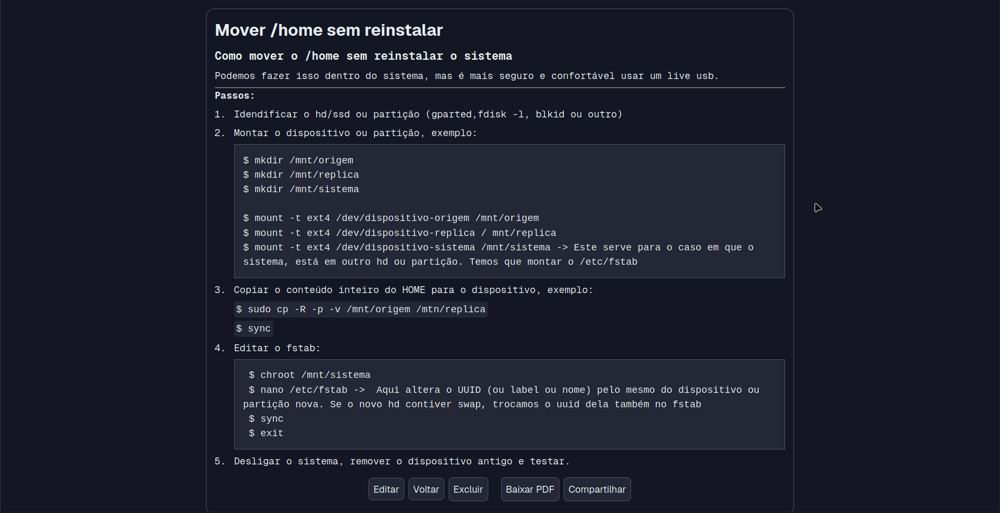
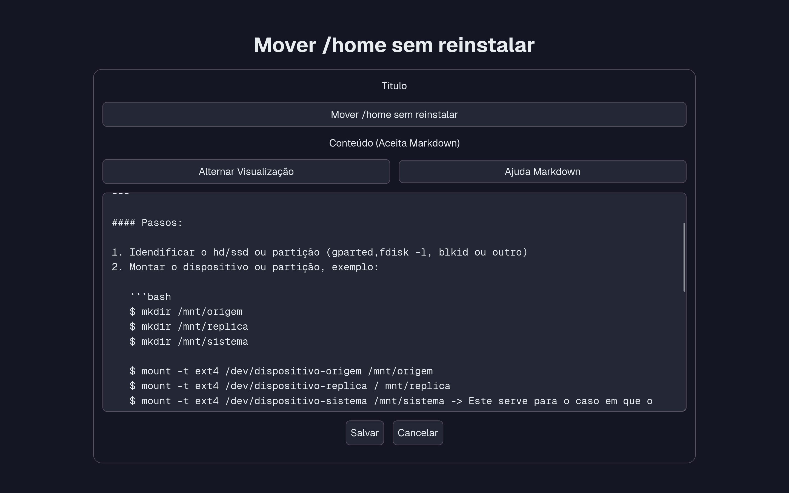

# MyNotes

> Uma aplicação de notas e how-tos construída com Next.js, React, TypeScript e Supabase, com foco em acessibilidade, simplicidade e evolução contínua da arquitetura.

## Sobre o projeto

O **MyNotes** nasceu com um objetivo muito simples: criar uma aplicação que eu próprio utilizasse no dia a dia.

Há vários anos que utilizo Linux como sistema operativo principal e, ao longo desse tempo, fui acumulando centenas de notas e pequenos how-tos sobre distribuições, ferramentas, editores de texto, configuração de ambientes de desenvolvimento e resolução de problemas.

Essas notas encontravam-se espalhadas por inúmeros ficheiros de texto, tornando cada vez mais difícil encontrar rapidamente a informação quando precisava dela.

Este projeto surgiu para resolver esse problema.

Em vez de procurar manualmente entre dezenas ou centenas de ficheiros, posso agora organizar as minhas notas, pesquisá-las rapidamente, editá-las, utilizar Markdown quando necessário e aceder a tudo através de uma interface simples, responsiva e acessível.

Embora tenha sido desenvolvido como um projeto de aprendizagem, o objetivo nunca foi criar apenas um projeto de portefólio. Desde o início procurei desenvolver uma aplicação suficientemente útil para continuar a utilizá-la depois de concluída.

---

## Demonstração

### Página inicial



Tela de autenticação utilizando OTP através do Supabase Authentication.

---

### Dashboard



Lista de notas com pesquisa, paginação e navegação para visualização.

---

### Visualização da nota



Suporte a texto simples e Markdown, com opções de exportação para PDF, partilha e edição.

---

### Edição de nota



Formulário reutilizado para criação e edição, com pré-visualização em Markdown.

---

## Objetivos do projeto

Este projeto teve vários objetivos de aprendizagem e evolução técnica.

### Desenvolver uma aplicação completa

O principal objetivo foi desenvolver uma aplicação real, desde a autenticação até à gestão completa de dados, incluindo:

- criação de conta;
- autenticação;
- criação de notas;
- edição;
- eliminação;
- pesquisa;
- paginação;
- partilha;
- exportação para PDF.

---

### Aprender Next.js

Outro objetivo importante foi começar a aprender o ecossistema do **Next.js**.

Em vez de tentar utilizar imediatamente todas as funcionalidades da framework, optei por uma abordagem incremental.

Nesta primeira versão procurei compreender bem conceitos como:

- App Router;
- estrutura de um projeto Next.js;
- páginas dinâmicas;
- sistema de routing;
- Metadata API;
- Route Announcements.

Grande parte da aplicação utiliza atualmente Client Components. Esta foi uma decisão consciente durante a fase inicial de aprendizagem, permitindo-me concentrar primeiro na estrutura da framework antes de aprofundar conceitos mais avançados como Server Components, Data Fetching no servidor ou Server Actions.

A arquitetura foi organizada de forma a facilitar uma migração gradual para uma abordagem mais orientada ao servidor no futuro.

---

### Acessibilidade desde o início

Outro objetivo muito importante foi desenvolver a aplicação com acessibilidade como parte integrante do projeto, e não como uma etapa final.

Desde as primeiras páginas houve preocupação com:

- HTML semântico;
- navegação completa por teclado;
- gestão correta do foco;
- utilização criteriosa de atributos ARIA;
- contraste entre cores;
- tamanhos de texto adequados;
- compatibilidade com leitores de ecrã.

Toda a aplicação foi testada manualmente utilizando apenas teclado e o leitor de ecrã ORCA.

---

## Funcionalidades

O MyNotes permite que cada utilizador tenha o seu próprio espaço privado para armazenar notas e how-tos.

Entre as principais funcionalidades encontram-se:

- autenticação por código OTP enviado por email;
- criação de conta;
- início e encerramento de sessão;
- reenvio do código de autenticação;
- criação de notas;
- edição de notas;
- eliminação de notas;
- pesquisa por título;
- paginação dos resultados;
- visualização de notas em texto simples ou Markdown;
- pré-visualização de Markdown durante a edição;
- exportação de notas para PDF;
- partilha de notas através da Web Share API (quando suportada pelo navegador);
- eliminação da conta do utilizador;
- remoção automática das notas através de `ON DELETE CASCADE`.

---

## Tecnologias utilizadas

### Frontend

- Next.js (App Router)
- React
- TypeScript

### Backend / BaaS

- Supabase
- Supabase Authentication (OTP)
- Supabase Database
- Supabase Edge Functions

### Renderização de conteúdo

- react-markdown
- remark-gfm

### Outras bibliotecas

- Lucide React
- html2pdf.js

---

## Demonstração da aplicação

A aplicação está organizada em diferentes páginas, cada uma com uma responsabilidade específica.

### Página inicial

A página inicial apresenta uma breve descrição da aplicação e o formulário de autenticação.

O acesso é realizado através de um código OTP enviado por email utilizando o sistema de autenticação do Supabase.

Após introduzir o código recebido, o utilizador é autenticado e encaminhado para o Dashboard.

Também existe a possibilidade de reenviar um novo código caso seja necessário.

---

### Dashboard

O Dashboard funciona como o ponto central da aplicação.

A partir desta página o utilizador pode:

- criar novas notas;
- pesquisar notas existentes;
- navegar entre páginas de resultados;
- abrir qualquer nota;
- terminar sessão;
- eliminar a própria conta.

Cada nota é apresentada sob a forma de um cartão contendo:

- título;
- data de criação;
- data da última atualização.

Cada cartão funciona como um link para a página de visualização completa da nota.

A paginação apresenta atualmente seis notas por página.

---

## 🏗️ Arquitetura da aplicação

Embora o MyNotes utilize o Next.js, a arquitetura atual é maioritariamente orientada para o cliente (*client-side*).

Esta foi uma decisão consciente durante o desenvolvimento.

Como um dos objetivos deste projeto era aprender a estrutura e os conceitos fundamentais do Next.js sem tentar utilizar todas as suas funcionalidades de uma só vez, optei por construir inicialmente uma aplicação baseada em Client Components, aproveitando o conhecimento que já possuía em React.

Esta abordagem permitiu-me concentrar primeiro em conceitos como:

- App Router;
- organização do projeto;
- páginas dinâmicas;
- Metadata API;
- Route Announcements;
- integração com o Supabase.

Ao mesmo tempo, procurei estruturar o projeto de forma a permitir uma migração gradual para uma arquitetura mais orientada ao servidor, sem necessidade de uma reescrita completa da aplicação.

Essa evolução encontra-se descrita na secção **Roadmap** deste README.

---

## Fluxo da aplicação

Depois da autenticação, o fluxo principal da aplicação é o seguinte:

1. O utilizador inicia sessão através do Supabase Authentication.
2. O Dashboard realiza o carregamento das notas armazenadas no Supabase.
3. As notas são guardadas em memória através de um Context do React.
4. A partir desse momento, operações como pesquisa, paginação e navegação utilizam prioritariamente os dados já carregados.
5. Sempre que uma nota é criada, editada ou eliminada, a alteração é enviada para o Supabase e o Context é atualizado para refletir imediatamente a mudança na interface.

Caso o utilizador atualize manualmente a página (por exemplo, utilizando F5), os dados necessários são novamente obtidos diretamente do Supabase.

Esta estratégia simplifica a experiência de utilização e reduz pedidos desnecessários ao backend durante a navegação normal da aplicação.

---

## Porque utilizei React Context?

Neste momento, o Context funciona como um pequeno armazenamento em memória das notas do utilizador.

Para o objetivo desta primeira versão, esta abordagem apresentou algumas vantagens:

- implementação simples;
- navegação rápida entre páginas;
- pesquisa instantânea;
- atualização imediata da interface após alterações.

Embora esta estratégia funcione muito bem para uma quantidade reduzida de notas, não seria necessariamente a abordagem mais adequada para aplicações com um volume muito elevado de dados.

Por esse motivo, a arquitetura foi preparada para que, futuramente, o carregamento das notas possa ser realizado diretamente no servidor, utilizando as ferramentas disponibilizadas pelo próprio ecossistema do Next.js e do Supabase.

---

## Organização do Metadata

Uma das funcionalidades do Next.js que mais despertou o meu interesse foi a Metadata API.

Para tirar partido deste recurso, cada página possui um pequeno ficheiro responsável apenas pela definição do respetivo metadata.

Esse ficheiro atua como um "wrapper" do componente principal da página.

Esta abordagem permite:

- manter o código de apresentação separado da configuração da página;
- definir facilmente o `document.title`;
- beneficiar dos Route Announcements fornecidos pelo App Router do Next.js;
- manter a organização do projeto simples e consistente.

---

## Estrutura geral da aplicação

A aplicação encontra-se organizada em diferentes áreas de responsabilidade.

De forma simplificada, o fluxo de navegação é o seguinte:

```text
Página Inicial
      │
      ▼
Autenticação (OTP)
      │
      ▼
 Dashboard
      │
      ├────────► Criar nota
      │
      └────────► Pesquisa
                     │
                     ▼
              Lista de notas
                     │
        ┌────────────┴────────────┐
        ▼                         ▼
   Paginação               Visualizar nota
                                     │
                           ┌─────────┼─────────┐
                           ▼         ▼         ▼
                        Editar   Eliminar   Exportar PDF
                                           │
                                           ▼
                                      Partilhar
```

---

## Autenticação

A autenticação é realizada através do Supabase Authentication utilizando códigos OTP enviados por email.

Este modelo elimina a necessidade de criação e gestão de palavras-passe pela própria aplicação.

O fluxo é simples:

1. o utilizador introduz o email;
2. o Supabase envia um código numérico;
3. o utilizador introduz esse código;
4. a sessão é criada;
5. o utilizador é encaminhado para o Dashboard.

Também existe a possibilidade de solicitar o reenvio de um novo código caso seja necessário.

---

## Gestão das notas

Cada utilizador possui acesso apenas às suas próprias notas.

As operações disponíveis incluem:

- criação;
- edição;
- eliminação;
- pesquisa;
- visualização.

A persistência é realizada através do Supabase Database.

As permissões de acesso são controladas através de Row Level Security (RLS), garantindo que cada utilizador apenas consegue aceder aos seus próprios dados.

---

## Eliminação da conta

A aplicação permite ao utilizador eliminar permanentemente a sua conta.

Para esta operação foi utilizada uma Edge Function do Supabase.

Após a remoção do utilizador, as respetivas notas são automaticamente eliminadas através da relação configurada na base de dados com `ON DELETE CASCADE`.

Desta forma, evita-se a existência de dados órfãos e garante-se que toda a informação associada ao utilizador é removida de forma consistente.

---

## Suporte a Markdown

As notas podem ser escritas em texto simples ou utilizando Markdown.

Para esse efeito são utilizadas as bibliotecas:

- `react-markdown`
- `remark-gfm`

Durante a edição existe uma funcionalidade de pré-visualização que permite verificar imediatamente o resultado da formatação antes de guardar a nota.

Além disso, encontra-se disponível um atalho direto para a documentação oficial do Markdown no GitHub, facilitando a consulta da sintaxe sempre que necessário.

---

## Exportação e partilha

Cada nota pode ser:

- exportada para PDF;
- partilhada através da Web Share API (quando suportada pelo navegador).

Estas funcionalidades procuram facilitar a reutilização do conteúdo fora da aplicação, permitindo guardar ou partilhar rapidamente qualquer nota.

---

## Design Responsivo

Toda a interface foi desenvolvida utilizando uma abordagem **Mobile First**.

O layout adapta-se a diferentes resoluções, desde dispositivos com aproximadamente **320px de largura** até ecrãs de maiores dimensões.

O objetivo foi garantir uma experiência consistente independentemente do dispositivo utilizado.

---

## Estrutura do projeto

A estrutura segue a organização recomendada pelo App Router do Next.js, procurando separar responsabilidades e facilitar a manutenção do código.

Entre os principais elementos encontram-se:

- páginas;
- componentes reutilizáveis;
- Context API;
- hooks personalizados;
- integração com o Supabase;
- utilitários;
- tipos TypeScript.

Ao longo do desenvolvimento procurei privilegiar componentes reutilizáveis sempre que possível.

Um exemplo disso é o formulário de criação e edição de notas.

Em vez de manter duas implementações distintas, ambas as páginas reutilizam exatamente o mesmo componente, alterando apenas os dados iniciais recebidos.

---

# ♿ Acessibilidade

A acessibilidade foi uma preocupação desde o início do desenvolvimento e fez parte das decisões de implementação ao longo de todo o projeto.

O objetivo nunca foi adicionar atributos ARIA indiscriminadamente ou cumprir uma lista de verificações, mas sim procurar construir uma interface simples, consistente e utilizável pelo maior número possível de pessoas.

Sempre que possível procurei privilegiar HTML semântico e recorrer a atributos ARIA apenas quando estes acrescentavam informação ou contexto que não era transmitido pelos elementos HTML nativos.

Entre os aspetos considerados durante o desenvolvimento encontram-se:

- utilização de HTML semântico;
- navegação integral através do teclado;
- gestão de foco durante a navegação;
- textos descritivos para elementos interativos;
- utilização criteriosa de atributos ARIA;
- contraste entre cores;
- tamanhos de letra adequados;
- hierarquia consistente de títulos;
- compatibilidade com leitores de ecrã.

---

## Testes automatizados

Ao longo do desenvolvimento foram utilizados diferentes analisadores de acessibilidade para identificar potenciais problemas e validar a interface.

As principais ferramentas utilizadas foram:

- WAVE
- IBM Equal Access Accessibility Checker
- Firefox Accessibility Inspector
- Lighthouse
- ARIA DevTools

Estas ferramentas permitiram identificar problemas comuns relacionados com semântica, contraste, atributos ARIA, formulários e navegação.

---

## Testes manuais

Para além dos testes automatizados, toda a aplicação foi utilizada manualmente recorrendo exclusivamente ao teclado e a um leitor de ecrã.

Os testes foram realizados utilizando:

- Sistema operativo Linux;
- Navegador Firefox;
- Leitor de ecrã ORCA.

Durante estes testes foram validados cenários como:

- autenticação;
- navegação entre páginas;
- criação de notas;
- edição;
- pesquisa;
- paginação;
- eliminação de notas;
- exportação para PDF;
- eliminação da conta.

O objetivo foi garantir que todas as funcionalidades principais da aplicação pudessem ser utilizadas sem recorrer ao rato.

---

## Uma nota sobre compatibilidade

Os testes manuais realizados neste projeto foram efetuados utilizando a combinação **Firefox + ORCA**, por ser o ambiente que utilizo diariamente.

Posso, por isso, afirmar com confiança que a aplicação foi cuidadosamente testada nesse contexto.

No entanto, não seria correto afirmar que a aplicação apresenta exatamente o mesmo comportamento em todas as combinações possíveis de navegadores, sistemas operativos e tecnologias de apoio.

Leitores de ecrã como NVDA, JAWS, VoiceOver ou Narrator podem apresentar diferenças de comportamento consoante o navegador utilizado.

Por esse motivo, este projeto não pretende afirmar uma compatibilidade universal, mas sim documentar de forma transparente o ambiente em que os testes foram efetivamente realizados.

Acredito que a honestidade sobre o processo de validação é mais importante do que fazer afirmações impossíveis de garantir.

---

# 💡 O que aprendi

Embora o objetivo inicial fosse aprender Next.js, este projeto acabou por proporcionar aprendizagem em áreas bastante mais abrangentes.

Ao longo do desenvolvimento aprofundei conhecimentos em:

- React;
- TypeScript;
- Next.js App Router;
- Metadata API;
- Supabase Authentication;
- Supabase Database;
- Supabase Edge Functions;
- integração entre frontend e backend;
- gestão de estado;
- organização de projetos;
- acessibilidade;
- HTML semântico;
- navegação por teclado;
- utilização prática de leitores de ecrã.

Mais do que aprender novas tecnologias, este projeto ajudou-me a compreender melhor a importância das decisões de arquitetura e da evolução incremental de uma aplicação.

Em vez de tentar utilizar todas as funcionalidades disponíveis desde o primeiro dia, procurei construir uma base sólida sobre a qual possa continuar a evoluir.

Essa abordagem permitiu-me terminar uma aplicação funcional sem deixar de criar espaço para continuar a aprender.

---

# Desafios encontrados

Algumas das dificuldades mais interessantes durante o desenvolvimento estiveram relacionadas com a acessibilidade e com a experiência de utilização.

Entre elas destacam-se:

- gestão correta do foco após alterações de página;
- integração entre o sistema de Metadata do Next.js e os Route Announcements;
- comportamento de leitores de ecrã em diferentes componentes;
- reutilização do formulário de criação e edição de notas;
- organização da arquitetura para permitir futuras migrações para uma abordagem mais orientada ao servidor.

Cada um destes desafios contribuiu para compreender melhor não apenas a utilização das ferramentas, mas também a importância de tomar decisões que facilitem a manutenção futura da aplicação.

---

# 🗺️ Roadmap

Embora a aplicação já seja totalmente funcional para o objetivo a que se destina, existem várias melhorias que pretendo implementar à medida que continuo a aprofundar os meus conhecimentos em Next.js e no ecossistema React.

Estas evoluções fazem parte do processo de aprendizagem que motivou este projeto.

## Acessibilidade

- [ ] Melhorar a gestão do foco após a mudança de página na paginação, colocando automaticamente o foco no primeiro cartão da nova página.
- [ ] Continuar a validar a aplicação com outras tecnologias de apoio sempre que tiver acesso a diferentes ambientes de teste.

## Arquitetura

- [ ] Reduzir gradualmente a dependência de Client Components.
- [ ] Introduzir Server Components sempre que fizer sentido.
- [ ] Explorar Server Actions.
- [ ] Migrar progressivamente o acesso aos dados para uma abordagem mais orientada ao servidor.

## Gestão de dados

- [ ] Deixar de carregar todas as notas após o login.
- [ ] Implementar paginação diretamente na base de dados.
- [ ] Carregar apenas as notas necessárias para cada página.
- [ ] Reavaliar a necessidade da Context API após essa migração.

## Funcionalidades

- [ ] Melhorar continuamente a experiência de utilização.
- [ ] Adicionar novas funcionalidades de organização das notas à medida que forem surgindo necessidades reais de utilização.

---

# 🚀 Como executar o projeto

## Pré-requisitos

Antes de iniciar o projeto deverá ter instalado:

- Node.js
- npm (ou outro gestor de pacotes compatível)

Também será necessária uma conta no Supabase para criar o projeto e obter as credenciais de acesso.

---

## Instalação

Clone o repositório:

```bash
git clone <url-do-repositorio>
```

Entre na pasta do projeto:

```bash
cd mynotes
```

Instale as dependências:

```bash
npm install
```

Crie um ficheiro `.env.local` e configure as variáveis de ambiente necessárias.

Depois execute:

```bash
npm run dev
```

A aplicação ficará disponível em:

```text
http://localhost:3000
```

---

# Variáveis de ambiente

O projeto necessita das credenciais do Supabase.

Exemplo:

```env
NEXT_PUBLIC_SUPABASE_URL=
NEXT_PUBLIC_SUPABASE_ANON_KEY=
```

Dependendo da configuração da Edge Function utilizada para eliminação da conta, poderão existir outras variáveis adicionais.

---

# Estrutura da base de dados

A aplicação utiliza uma tabela simples para armazenar as notas dos utilizadores.

Cada nota possui:

- identificador;
- utilizador proprietário;
- título;
- conteúdo;
- resumo;
- data de criação;
- data da última atualização.

O acesso aos dados é protegido através de **Row Level Security (RLS)**, garantindo que cada utilizador apenas pode consultar e modificar as suas próprias notas.

A remoção da conta utiliza uma Edge Function do Supabase e a eliminação das notas associadas é efetuada automaticamente através de `ON DELETE CASCADE`.

---

# Porque desenvolvi este projeto desta forma?

Durante o desenvolvimento procurei encontrar um equilíbrio entre aprender novas tecnologias e construir uma aplicação que fosse realmente útil.

Seria possível recorrer desde o início a uma arquitetura mais complexa, explorando um maior número de funcionalidades do Next.js.

No entanto, preferi consolidar primeiro os conceitos fundamentais antes de aumentar a complexidade da aplicação.

Esta abordagem permitiu-me compreender melhor cada decisão tomada, evitar introduzir soluções que ainda não dominava e preparar o projeto para evoluir gradualmente à medida que continuo a aprender.

Acredito que uma evolução incremental é mais sustentável do que tentar utilizar todas as funcionalidades disponíveis apenas porque a tecnologia as oferece.

---

# Considerações finais

O MyNotes representa muito mais do que um exercício técnico.

Foi uma oportunidade para desenvolver uma aplicação que resolve um problema real do meu dia a dia enquanto, simultaneamente, aprofundava conhecimentos em React, TypeScript, Next.js e Supabase.

Ao longo do desenvolvimento procurei dar especial atenção à organização do código, à reutilização de componentes, à acessibilidade e à experiência de utilização, sempre procurando compreender o motivo por detrás de cada decisão técnica.

Embora existam várias melhorias planeadas para o futuro, considero que esta primeira versão estabelece uma base sólida para continuar a evoluir o projeto e explorar progressivamente mais funcionalidades do ecossistema Next.js.

Mais do que apresentar um produto final, este repositório documenta o meu processo de aprendizagem e a forma como procuro construir software: começando por soluções simples, funcionando corretamente, e evoluindo-as de forma consciente e incremental.
