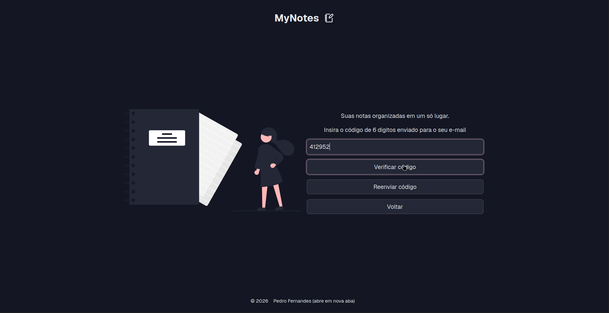
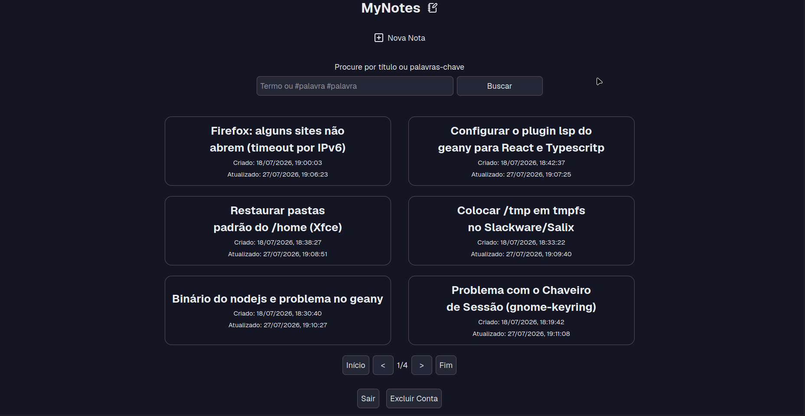
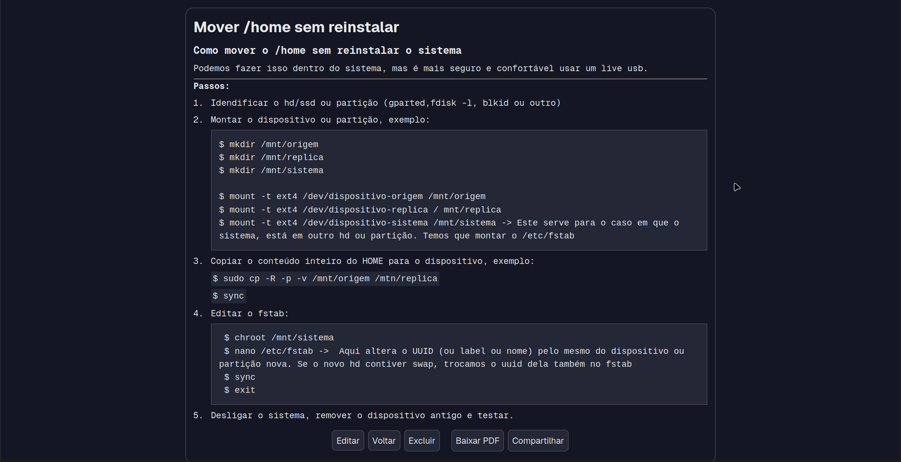
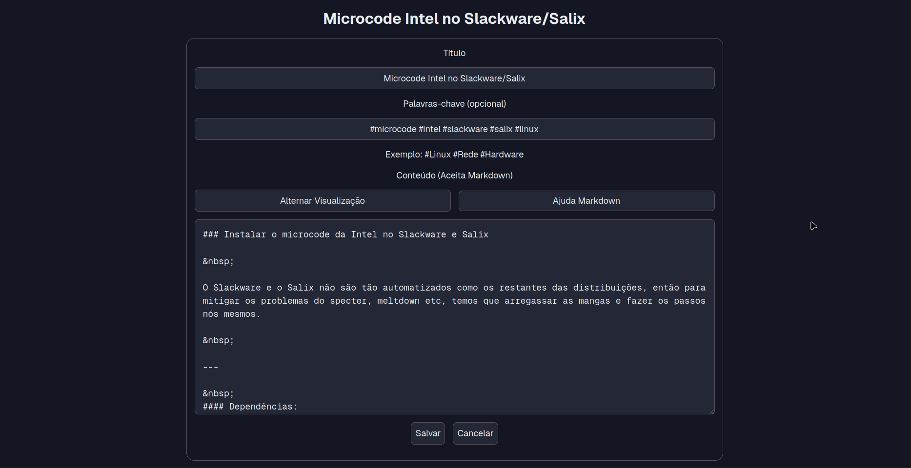

# MyNotes

O **MyNotes** é uma aplicação web desenvolvida para organizar conhecimento técnico de forma simples, rápida e acessível.

O projeto nasceu para resolver um problema real do meu dia a dia. Ao longo de vários anos fui acumulando centenas de pequenas notas e *how-tos* em ficheiros de texto: comandos de Linux, configurações de ferramentas, soluções para erros recorrentes, apontamentos sobre JavaScript, Bash e outros temas técnicos.

Encontrar uma determinada informação dentro de um ficheiro nunca foi um problema.

O verdadeiro desafio era lembrar **em que ficheiro essa informação estava**.

Em vez de adaptar a minha forma de trabalhar a uma aplicação existente, decidi desenvolver uma ferramenta que refletisse exatamente a forma como organizo o meu próprio conhecimento.

Assim nasceu o **MyNotes**.

Embora tenha começado como um projeto pessoal, acabou também por se tornar uma excelente oportunidade para começar a aprender os fundamentos do **Next.js**, explorando o seu ecossistema enquanto desenvolvia uma aplicação que utilizo diariamente.

Hoje o MyNotes é simultaneamente:

- uma ferramenta que utilizo para organizar conhecimento técnico;
- um projeto que demonstra a minha abordagem ao desenvolvimento frontend;
- uma aplicação construída com especial atenção à acessibilidade, experiência de utilização e simplicidade.

## Filosofia do projeto

Durante todo o desenvolvimento procurei seguir uma ideia muito simples:

> **Quando uma solução simples resolve adequadamente um problema, não faz sentido introduzir uma solução mais complexa apenas porque ela existe.**

Por esse motivo, várias funcionalidades e abordagens foram analisadas durante o desenvolvimento, mas apenas foram implementadas quando acrescentavam valor real à aplicação.

O MyNotes continua a evoluir através do uso diário. Novas funcionalidades ou alterações arquiteturais serão sempre avaliadas com base em necessidades reais identificadas durante a utilização da aplicação, e não apenas por seguirem tendências ou convenções.

# Motivação

Utilizo Linux há cerca de 12 anos e, ao longo desse tempo, fui acumulando uma quantidade considerável de notas técnicas.

A maioria eram pequenos *how-tos* criados para resolver problemas específicos ou guardar informação que sabia que iria voltar a precisar no futuro. Desde configurações de distribuições Linux, comandos Bash, apontamentos sobre JavaScript, até procedimentos de instalação e resolução de erros.

Durante muito tempo essas notas viveram em dezenas — ou melhor, centenas — de ficheiros de texto.

Esse método tinha uma vantagem importante: era extremamente simples.

Mas também tinha um problema.

À medida que a quantidade de informação aumentava, deixava de ser difícil encontrar uma determinada nota **dentro de um ficheiro**.

O verdadeiro problema era lembrar **em que ficheiro essa nota estava**.

Foi precisamente essa necessidade que deu origem ao MyNotes.

O objetivo nunca foi criar uma aplicação de notas genérica nem substituir ferramentas já existentes.

Queria apenas construir uma ferramenta que se adaptasse à forma como eu próprio organizo o meu conhecimento técnico.

Ao longo do desenvolvimento aconteceu algo curioso.

O projeto deixou de ser apenas uma forma de resolver um problema pessoal e transformou-se também numa excelente oportunidade para aprender novas tecnologias e consolidar conhecimentos de desenvolvimento frontend.

Embora o objetivo inicial fosse começar a aprender **Next.js**, rapidamente percebi que este projeto também me permitia aprofundar áreas igualmente importantes, como:

- arquitetura de aplicações frontend;
- gestão eficiente de estado e cache com TanStack Query;
- integração com Supabase;
- acessibilidade;
- experiência de utilização;
- organização de código;
- tomada de decisões arquiteturais.

Mais do que aprender funcionalidades específicas de uma framework, este projeto acabou por me ensinar algo que considero ainda mais importante:

> **Nem todas as funcionalidades disponíveis precisam de ser utilizadas.**

Ao longo do desenvolvimento procurei sempre encontrar o equilíbrio entre simplicidade, manutenção e experiência de utilização.

Sempre que uma solução simples resolvia adequadamente o problema, essa foi a solução escolhida.

Essa filosofia continua a orientar a evolução do MyNotes.

# Objetivos do projeto

Desde o início, o MyNotes foi desenvolvido com alguns objetivos muito claros.

Mais do que construir uma aplicação de notas, a intenção era desenvolver uma ferramenta simples, rápida e agradável de utilizar no dia a dia, aplicando simultaneamente boas práticas de desenvolvimento frontend.

Os principais objetivos foram:

- Organizar conhecimento técnico de forma simples e eficiente.
- Permitir localizar rapidamente qualquer nota através da pesquisa.
- Criar uma interface limpa, responsiva e intuitiva.
- Desenvolver uma aplicação acessível desde o início, e não como uma preocupação adicionada no final do projeto.
- Explorar os fundamentos do ecossistema Next.js através de um projeto real.
- Consolidar conhecimentos de React, TypeScript e integração com Supabase.
- Construir uma aplicação que eu próprio utilizasse diariamente, permitindo que a evolução do projeto fosse orientada pelo uso real.

## O que este projeto não pretende ser

O MyNotes não pretende ser uma plataforma completa de gestão de conhecimento nem competir diretamente com aplicações como Notion, Obsidian ou Joplin.

O foco sempre foi outro.

Cada decisão tomada durante o desenvolvimento procurou responder à seguinte pergunta:

> **Esta funcionalidade resolve um problema que tenho atualmente?**

Quando a resposta era "sim", a funcionalidade era implementada.

Quando a resposta era "não", mesmo que fosse tecnicamente interessante ou comum noutras aplicações, a funcionalidade ficava de fora.

Esta abordagem permitiu manter o projeto simples, coerente e fácil de manter, evitando adicionar complexidade desnecessária apenas porque uma determinada tecnologia ou funcionalidade existia.

Ao mesmo tempo, a arquitetura da aplicação foi desenvolvida de forma a permitir evolução futura, caso novas necessidades reais venham a surgir durante a utilização do MyNotes.

# Demonstração

O projeto encontra-se disponível online e pode ser explorado através do link abaixo.

## Aplicação

🔗 **Deploy:** *https://my-awesome-notes.vercel.app*

## Capturas de ecrã

### Página inicial



Tela de autenticação utilizando OTP através do Supabase Authentication.

---

### Dashboard



Lista de notas com pesquisa, paginação e navegação para visualização.

---

### Visualização da nota



Suporte a texto simples e Markdown, com opções de exportação para PDF, partilha e edição.

---

### Edição de nota



Formulário reutilizado para criação e edição, com pré-visualização em Markdown.

# Funcionalidades

O MyNotes foi desenvolvido para tornar a organização e recuperação de conhecimento técnico simples e eficiente.

Atualmente a aplicação oferece as seguintes funcionalidades.

---

## Autenticação

- Autenticação através de **OTP (One-Time Password)** utilizando o Supabase.
- Sessões persistentes.
- Proteção de todas as rotas autenticadas.

---

## Gestão de notas

- Criar novas notas.
- Editar notas existentes.
- Eliminar notas.
- Visualizar notas individuais.

Cada nota pode ser escrita utilizando:

- texto simples;
- Markdown.

---

## Pesquisa

A pesquisa permite localizar rapidamente qualquer nota através do seu título ou de palavras-chave.

Para realizar uma pesquisa, o utilizador introduz o termo pretendido ou as palavras-chave e confirma a ação através do botão **Buscar**.

Esta abordagem foi uma escolha consciente, privilegiando um comportamento simples e previsível, adequado à forma como utilizo a aplicação no dia a dia.

---

## Paginação

O dashboard apresenta as notas de forma paginada.

Em vez de carregar todas as notas após a autenticação, a aplicação obtém apenas os registos necessários para cada página.

Esta abordagem reduz a quantidade de dados transferidos e melhora a experiência de utilização, mantendo tempos de resposta consistentes mesmo com um número crescente de notas.

---

## Pré-visualização em Markdown

Durante a edição, é possível alternar entre:

- modo de edição;
- pré-visualização.

Isto permite verificar imediatamente o resultado final antes de guardar a nota.

---

## Exportação para PDF

Cada nota pode ser exportada diretamente para PDF, preservando a estrutura e a formatação do conteúdo.

Esta funcionalidade facilita o arquivo ou impressão de informação técnica.

---

## Partilha

Quando suportado pelo navegador e pelo dispositivo, é possível partilhar notas utilizando a **Web Share API**.

---

## Interface responsiva

Toda a aplicação foi desenvolvida para funcionar corretamente em:

- computadores;
- tablets;
- dispositivos móveis.

Os componentes adaptam-se automaticamente a diferentes tamanhos de ecrã sem comprometer a experiência de utilização.

---

## Acessibilidade

Desde o início do desenvolvimento procurei construir uma aplicação acessível.

Entre as medidas implementadas encontram-se:

- HTML semântico;
- navegação completa por teclado;
- gestão de foco;
- utilização criteriosa de atributos ARIA;
- contraste adequado;
- mensagens anunciadas corretamente durante alterações importantes da interface.

Para além das validações automáticas, foram realizados testes manuais utilizando:

- **ORCA Screen Reader**
- **Firefox**

Foi também testada a navegação exclusivamente por teclado em Firefox, Chrome e Brave.

# Tecnologias utilizadas

O MyNotes foi desenvolvido recorrendo a tecnologias modernas do ecossistema frontend, escolhidas de acordo com as necessidades reais do projeto.

## Next.js

O projeto foi desenvolvido com **Next.js** como forma de começar a aprender os fundamentos da framework através de uma aplicação real.

Ao longo do desenvolvimento foram exploradas funcionalidades como:

- App Router;
- Rotas dinâmicas;
- Metadata API;
- Route Announcements.

Embora o Next.js disponibilize funcionalidades mais avançadas, como Server Components ou Server Actions, optei conscientemente por não as utilizar apenas porque existem.

Para a natureza altamente interativa desta aplicação, uma abordagem maioritariamente baseada em **Client Components** revelou-se suficientemente simples, clara e adequada.

A arquitetura permanece preparada para evoluir futuramente, caso a utilização da aplicação venha a justificar essa mudança.

---

## React

O React é responsável pela construção de toda a interface da aplicação.

A utilização de componentes reutilizáveis permitiu manter o código organizado, modular e de fácil manutenção.

---

## TypeScript

Todo o projeto foi desenvolvido em **TypeScript**.

A tipagem estática permitiu reduzir erros durante o desenvolvimento, melhorar a manutenção do código e tornar a comunicação entre componentes mais segura.

---

## Supabase

O **Supabase** é utilizado como backend da aplicação.

Atualmente é responsável por:

- autenticação por OTP;
- armazenamento das notas;
- gestão da base de dados;
- políticas de segurança através de Row Level Security (RLS).

---

## TanStack Query

A gestão de dados é realizada através do **TanStack Query**.

A biblioteca é utilizada para:

- obtenção de dados;
- cache automático;
- sincronização entre cliente e servidor;
- invalidação automática da cache após alterações;
- gestão simplificada dos estados de carregamento.

A utilização do TanStack Query permitiu eliminar a necessidade de recorrer a um contexto global para armazenar notas, simplificando significativamente a arquitetura da aplicação.

---

## React Markdown

Utilizado para converter e apresentar notas escritas em Markdown de forma segura e simples.

---

## html2pdf.js

Biblioteca utilizada para gerar a exportação das notas em formato PDF diretamente no navegador.

---

## Web Share API

Sempre que suportada pelo navegador, permite partilhar notas utilizando os mecanismos nativos do dispositivo.

---

## CSS

Toda a interface foi desenvolvida utilizando **CSS puro**.

Não foram utilizados frameworks CSS.

A estilização foi construída recorrendo a:

- Custom Properties (CSS Variables);
- Flexbox;
- CSS Grid;
- Media Queries;
- `clamp()` para tipografia responsiva.

Esta abordagem permitiu manter controlo total sobre o comportamento visual da aplicação e implementar facilmente requisitos específicos de acessibilidade.

# 🏗️ Arquitetura

Ao longo do desenvolvimento, a arquitetura do MyNotes evoluiu várias vezes.

Inicialmente o projeto seguia uma abordagem mais tradicional, recorrendo a **React Context** para armazenar as notas carregadas após a autenticação.

À medida que a aplicação cresceu e fui aprofundando conhecimentos sobre gestão de dados no ecossistema React, essa abordagem foi sendo substituída por uma solução mais simples e adequada ao problema.

Atualmente toda a gestão de dados da aplicação é realizada através do **TanStack Query**.

Esta mudança permitiu reduzir a complexidade da aplicação, eliminar estado global desnecessário e simplificar significativamente a comunicação com o Supabase.

## Fluxo geral dos dados

Atualmente o fluxo de obtenção de dados pode ser resumido da seguinte forma:

```text
Utilizador
        │
        ▼
Interface (React / Next.js)
        │
        ▼
TanStack Query
        │
        ▼
Supabase
        │
        ▼
Resposta
        │
        ▼
Cache
        │
        ▼
Interface atualizada
```

A interface nunca comunica diretamente com a base de dados.

Toda a obtenção, atualização e invalidação dos dados é centralizada através do TanStack Query.

---

## Dashboard

Após a autenticação, o dashboard apresenta apenas uma página de resultados de cada vez.

Em vez de carregar todas as notas existentes, a aplicação solicita apenas os registos necessários para a página atualmente visualizada.

A paginação é realizada diretamente pelo Supabase utilizando consultas com `range()`, reduzindo significativamente a quantidade de dados transferidos.

Sempre que o utilizador muda de página, apenas os novos registos são obtidos.

---

## Cache

O TanStack Query mantém automaticamente uma cache das consultas realizadas.

Isto permite, por exemplo:

- evitar pedidos desnecessários;
- reutilizar resultados recentes;
- manter a interface responsiva;
- simplificar a sincronização entre cliente e servidor.

Sempre que uma nota é criada, editada ou eliminada, a cache correspondente é automaticamente invalidada, garantindo que a informação apresentada permanece consistente.

---

## Porque não utilizei React Context?

Durante o desenvolvimento cheguei à conclusão de que um contexto global deixava de acrescentar valor ao projeto.

A responsabilidade do React Context seria apenas armazenar dados que já eram geridos de forma muito mais eficiente pelo TanStack Query.

Ao eliminar essa camada intermédia consegui:

- reduzir código;
- simplificar a arquitetura;
- evitar duplicação de estado;
- tornar o fluxo de dados mais previsível.

---

## Porque mantive uma abordagem maioritariamente client-side?

Sendo este um projeto desenvolvido com Next.js, naturalmente surgiu a questão de utilizar funcionalidades como:

- Server Components;
- Server Actions;
- acesso aos dados diretamente no servidor.

Estas possibilidades foram analisadas durante o desenvolvimento.

No entanto, para a natureza altamente interativa do MyNotes, não encontrei vantagens suficientemente significativas que justificassem aumentar a complexidade da arquitetura.

Grande parte da aplicação consiste em:

- pesquisa em tempo real;
- edição de notas;
- pré-visualização em Markdown;
- exportação para PDF;
- partilha;
- navegação rápida entre páginas.

Neste contexto, uma abordagem baseada em Client Components revelou-se suficientemente simples, eficiente e fácil de manter.

Isto não significa que essas funcionalidades não venham a ser utilizadas no futuro.

Caso a evolução da aplicação venha a demonstrar benefícios reais na sua utilização, essa possibilidade será naturalmente reavaliada.

# ♿ Acessibilidade

A acessibilidade foi considerada desde o início do desenvolvimento do MyNotes e não apenas adicionada numa fase final do projeto.

O objetivo sempre foi construir uma aplicação utilizável tanto por pessoas que utilizam rato como por quem depende exclusivamente do teclado ou de tecnologias de apoio.

Ao longo do desenvolvimento procurei privilegiar soluções baseadas em HTML semântico e comportamento nativo dos elementos, recorrendo a atributos ARIA apenas quando estes acrescentavam efetivamente valor.

## Medidas implementadas

Entre as principais medidas de acessibilidade presentes na aplicação destacam-se:

- utilização de HTML semântico;
- estrutura consistente de títulos;
- navegação completa através do teclado;
- gestão adequada do foco durante a navegação;
- indicadores visuais claros de foco;
- contraste adequado entre texto e fundo;
- utilização criteriosa de atributos ARIA;
- anúncios de alterações importantes da interface através de regiões `aria-live`;
- Route Announcements disponibilizados pelo Next.js.

Sempre que possível procurei utilizar soluções nativas do navegador antes de recorrer a implementações personalizadas.

---

## Gestão do foco

Foi dedicada especial atenção à gestão do foco entre páginas e componentes.

Alguns exemplos incluem:

- após fechar um diálogo modal, o foco regressa ao elemento que o abriu;
- ao regressar da visualização ou edição de uma nota, o foco volta ao botão correspondente da nota anteriormente selecionada;
- os diálogos modais implementam *focus trapping*, impedindo que o foco saia do modal enquanto este permanece aberto.

Estas pequenas interações ajudam a tornar a navegação previsível para utilizadores de teclado e leitores de ecrã.

---

## Testes realizados

Para além das validações automáticas, foram realizados testes manuais durante todo o desenvolvimento.

Os principais testes incluíram:

### Leitor de ecrã

- ORCA Screen Reader
- Firefox

Este é o ambiente onde consigo garantir o correto funcionamento da aplicação do ponto de vista da acessibilidade.

---

### Navegação por teclado

Foram igualmente realizados testes completos utilizando apenas o teclado em:

- Firefox;
- Chrome;
- Brave.

---

## Limitações conhecidas

Embora tenham sido seguidas boas práticas de acessibilidade e realizados testes manuais, não foi possível validar o comportamento da aplicação em todos os leitores de ecrã e navegadores existentes.

Em particular, não foi possível realizar testes com **NVDA** por não dispor atualmente de um ambiente Windows.

Por esse motivo, apenas posso garantir o comportamento observado durante os testes realizados com:

- ORCA + Firefox;
- navegação exclusivamente por teclado em Firefox, Chrome e Brave.

À medida que o projeto evoluir e existam novos ambientes disponíveis para testes, esta secção será naturalmente atualizada.

Uma outra limitação observada durante os testes diz respeito ao botão **Buscar** do formulário de pesquisa.
Quando a pesquisa não encontra correspondências, o leitor de ecrã ORCA anuncia o botão **Buscar** duas vezes antes de anunciar
a mensagem "Nenhuma correspondência encontrada".

Exemplo:

- Quando existem resultados:
  - "Buscar - botão de apertar"
  - 5 correspondências encontradas"
- Quando não existem resultados:
  - "Buscar - botão de apertar"
  - "Buscar - botão de apertar"
  - "Nenhuma correspondência encontrada"

Apesar desta repetição, nenhuma informação é perdida, uma vez que a mensagem final é sempre anunciada corretamente. Após várias tentativas de investigação, não foi possível determinar se este comportamento resulta da implementação da aplicação ou de uma particularidade do ORCA. Por esse motivo, esta limitação permanece documentada até que possa ser validada noutros leitores de ecrã, como o NVDA.

# Estrutura do projeto

```
mynotes/
├── database/
│   ├── schema.sql
│   └── email-template.html
│
├── public/
│
├── src/
│   ├── app/
│   ├── components/
|   ├── context/
|   ├── data/
│   ├── hooks/
│   ├── lib/
│   ├── providers/
│   ├── types/
│   └── utils/
│
├── package.json
└── README.md
```

A estrutura procura manter uma separação clara entre:

- interface;
- componentes reutilizáveis;
- integração com Supabase;
- utilitários;
- lógica da aplicação.

---

# 🚀 Como executar o projeto

## 1. Clonar o repositório

```bash
git clone https://github.com/pedrobfernandes/MyNotes.git

cd my-notes
```

---

## 2. Instalar dependências

```bash
npm install
```

---

## 3. Criar projeto no Supabase

Criar um novo projeto em:

https://supabase.com

Após a criação, obter:

- Project URL
- anon public key

---

## 4. Criar o ficheiro `.env.local`

```env
NEXT_PUBLIC_SUPABASE_URL=url_do_projeto
NEXT_PUBLIC_SUPABASE_PUBLISHABLE_KEY=sua_chave_anon_publica
NEXT_PUBLIC_SUPABASE_DELETE_ACCOUNT_URL=url_da_edge_function_para_excluir_conta

```

---

# Configuração da base de dados

## 1. Executar o script SQL

No painel do Supabase:

```
SQL Editor
```

Copiar e executar o conteúdo do ficheiro:

```
database/my-notes-setup.sql
```

---

## O que este script cria

O script é responsável por:

- criação da tabela de notas;
- índices;
- políticas RLS;
- permissões necessárias;
- restantes objetos utilizados pela aplicação.

---

# Configurações de autenticação

A aplicação utiliza autenticação através de **OTP (One-Time Password)**.

No dashboard do Supabase, procure pelos templates de Email, e use o template da pasta `database/supabase-email-template` para "Confirm sign up" e "Magic link"

Em seguida, procure `Authentication` e lá, encontre `Sign in/Providers`. Nessa página encontre `Auth Providers` e então abra as configurações de `Email`,
(que por padrão já vem como `Enabled`). Nas configurações, navege até á opção `Email OTP length` e altere de 8 para 6 digitos.

---

# Edge Function

A aplicação utiliza uma Edge Function para deletar a conta de usuario e todas as notas através da regra na tabela `ON DELETE CASCADE`:

Criar uma nova Edge Function:

- dashboard do Supabase -> `Edge Functions`
- `Deploy a new function` -> `Via editor`
- `Function name` -> `delete-user-account`
- copie e cole este script no editor e em seguida -> `Deploy function`

```typescript
   import { serve } from "https://deno.land/std@0.177.0/http/server.ts";
   import { createClient } from 'https://esm.sh/@supabase/supabase-js@2';

   // Se colocar online substituir o Access-Control-Allow-Origin: '*'
   // por Access-Control-Allow-Origin': 'url-do-deploy'
   const corsHeaders = {
     'Access-Control-Allow-Origin': '*',
     'Access-Control-Allow-Headers': 'authorization, x-client-info, apikey, content-type'
   };
   serve(async (req)=>{
     // Handle CORS
     if (req.method === 'OPTIONS') {
       return new Response('ok', {
         headers: corsHeaders
       });
     }
     try {
       // Criar cliente Supabase com service role key
       const supabaseAdmin = createClient(Deno.env.get('SUPABASE_URL') ?? '', Deno.env.get('SUPABASE_SERVICE_ROLE_KEY') ?? '');
       // Obter o token JWT do header
       const authHeader = req.headers.get('Authorization');
       if (!authHeader) {
         throw new Error('Missing authorization header');
       }
       // Verificar e validar o token do usuário
       const { data: { user }, error: userError } = await supabaseAdmin.auth.getUser(authHeader.replace('Bearer ', ''));
       if (userError || !user) {
         throw new Error('Invalid token');
       }
       const userId = user.id;
       // ✅ SIMPLES: Apenas deletar o usuário
       // O CASCADE vai automaticamente deletar todos os dados relacionados
       const { error: deleteUserError } = await supabaseAdmin.auth.admin.deleteUser(userId);
       if (deleteUserError) {
         throw deleteUserError;
       }
       return new Response(JSON.stringify({
         success: true,
         message: 'Conta e todos os dados foram deletados com sucesso'
       }), {
         headers: {
           ...corsHeaders,
           'Content-Type': 'application/json'
         },
         status: 200
       });
     } catch (error) {
       console.error('Erro na função delete-user:', error);
       return new Response(JSON.stringify({
         success: false,
         error: error.message
       }), {
         headers: {
           ...corsHeaders,
           'Content-Type': 'application/json'
         },
         status: 400
       });
     }
   });

  ```

---

# Executar a aplicação

```bash
npm run dev
```

A aplicação ficará disponível em:

```
http://localhost:3000
```

---

# Build de produção

```bash
npm run build

npm start
```

---

# Tecnologias necessárias

- Node.js
- npm
- Conta Supabase
- Projeto Supabase criado

# 🗺️ Roadmap

O MyNotes é uma aplicação que utilizo diariamente.

Por esse motivo, a evolução do projeto não será orientada pela quantidade de funcionalidades implementadas, mas sim pelas necessidades que forem surgindo durante a utilização da aplicação.

Cada nova funcionalidade será avaliada de acordo com uma pergunta muito simples:

> **Esta alteração resolve um problema real identificado durante a utilização do projeto?**

Se a resposta for "sim", a funcionalidade será considerada.

Caso contrário, a aplicação continuará simples, evitando adicionar complexidade desnecessária.

---

## Arquitetura

Estas são áreas que pretendo continuar a explorar à medida que aprofundo conhecimentos sobre o ecossistema Next.js.

- [ ] Avaliar a introdução de **Server Components** em cenários onde tragam benefícios reais.
- [ ] Explorar **Server Actions** sempre que possam simplificar a arquitetura da aplicação.
- [ ] Continuar a aprender funcionalidades do Next.js e avaliar a sua aplicação no projeto.

---

## Organização das notas

À medida que o número de notas aumentar, poderão surgir novas necessidades de organização.

Estas funcionalidades serão avaliadas apenas caso façam sentido durante a utilização da aplicação.

Possíveis evoluções incluem:

- [ ] Avaliar pesquisa também pelo conteúdo das notas.
- [ ] Avaliar sistemas complementares de organização, como etiquetas (tags), caso a pesquisa por título e palavras-chave deixem de ser suficientes.

---

## Acessibilidade

Embora tenham sido realizados testes manuais ao longo de todo o desenvolvimento, esta continua a ser uma área em evolução.

Pretendo continuar a melhorar a acessibilidade da aplicação sempre que identificar oportunidades para o fazer.

Possíveis evoluções:

- [ ] Testar a aplicação com novos leitores de ecrã se e quando disponiveis.
- [ ] Validar comportamento em diferentes navegadores e plataformas.
- [ ] Continuar a melhorar pequenos detalhes relacionados com navegação por teclado e gestão do foco.

---

## Evolução contínua

O MyNotes continuará a evoluir principalmente através da utilização diária da aplicação.

Como sou atualmente o principal utilizador do projeto, muitas melhorias surgirão naturalmente da experiência de utilização no dia a dia.

Caso outros utilizadores venham a utilizar a aplicação e forneçam sugestões ou feedback, essas propostas serão igualmente analisadas e poderão contribuir para futuras evoluções do projeto.

# Considerações finais

O MyNotes começou como uma forma de resolver um problema muito simples do meu dia a dia.

Ao longo dos anos fui acumulando centenas de pequenas notas técnicas, distribuídas por inúmeros ficheiros de texto. Encontrar informação dentro de um ficheiro nunca foi difícil; o verdadeiro desafio era lembrar em que ficheiro essa informação estava.

Construir esta aplicação permitiu-me resolver esse problema de uma forma que se adapta exatamente à forma como organizo o meu conhecimento.

Ao mesmo tempo, o projeto acabou por se tornar uma excelente oportunidade para começar a aprender Next.js através de uma aplicação real.

Durante o desenvolvimento fui explorando diferentes abordagens, tecnologias e possibilidades arquiteturais. Algumas foram implementadas, outras foram conscientemente deixadas de fora.

Talvez a maior aprendizagem deste projeto não tenha sido uma funcionalidade específica do Next.js ou uma biblioteca em particular.

Foi perceber que desenvolver software não significa utilizar todas as ferramentas disponíveis.

Significa compreender o problema, escolher a solução mais adequada para esse contexto e aceitar que, muitas vezes, a solução mais simples é também a melhor.

Essa filosofia esteve presente em praticamente todas as decisões tomadas durante o desenvolvimento do MyNotes e continuará a orientar a evolução do projeto.

Hoje esta aplicação faz parte do meu dia a dia e continuará a evoluir à medida que novas necessidades reais forem surgindo.

Se chegou até aqui, obrigado pelo tempo dedicado a conhecer o projeto. Caso tenha alguma sugestão, feedback ou simplesmente queira conversar sobre desenvolvimento frontend, acessibilidade ou Next.js, terei todo o gosto em falar consigo.
